# what-is-fullstack
Someone who can build an application from start to finish, including front end and backend.
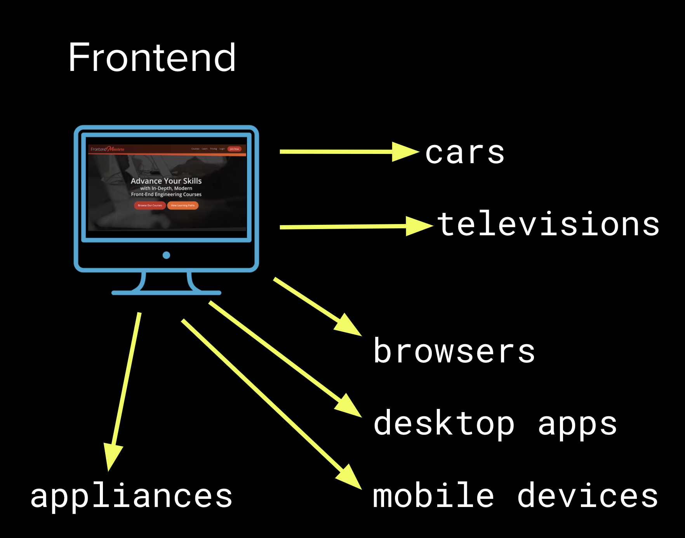
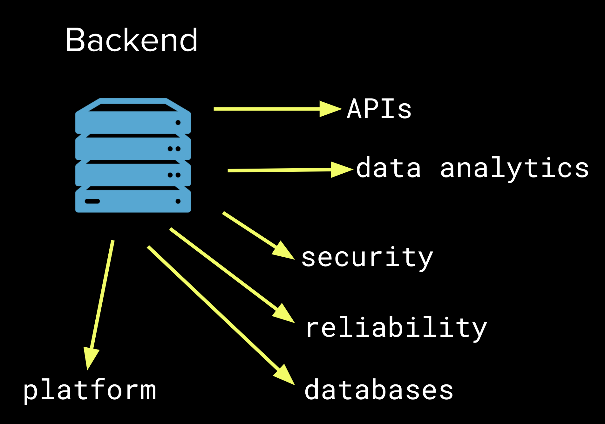

### Why Fullstack
You can master all the techniques involved in a development project. You can make a prototype very rapidly. You can provide help to all the team members.

Full stack developers ensure the openness of application and they also work alongside graphic designers as well for features of web design and many other tasks. They are necessary to look into web projects from the start to its final form.

### Command Line
Every operating system have command line, whether its windows, mac or linux. Its consistent, the command line always gonna be the same. 
- Fast
- Consistent
- Easier to automate

Command line are important because not all server have a GUI (Graphical User Interface) and theres no limitation, no matter how well designed the GUI you cannot encompass all the possibilities. Some example of more familiar command line :
- `cd` - change directory
- `ls` - list directory content
- `pwd` - print working directory
- `mkdir` - make directory
- `rmdir` - remove directory
- `cat` - show file contents
- `man` - command manual
- `less` - show file contents by page
- `rm` - remove file
- `echo` - repeat input

### Shells
Is the one that included with a lot of UNIX systems by default but it basically allows you to run command lines, and run a lot of the basic systems that come along with UNIX. 
- shells - Command intepreter to interface with systems
- terminal - runs shells application

The shells is just a frontline that is the user interface of some sorts, and it just talk to the application or the OS which talk to the kernel, and the kernel is the core of operating system.

# Understanding the Internet
It works by using a packet routing network that follows Internet Protocol (IP) and Transport Control Protocol (TCP) [5]. TCP and IP work together to ensure that data transmission across the internet is consistent and reliable, no matter which device you're using or where you're using it. Basically a series of system globally interconnected devices. Not to be confused with intranet, which basically internet but private.

Some list to understand the internet better :
- internet - A system of globally interconnected devices
- intranet - Private internet
- IP - Internet Protocol
- IP Address - A label assigned to an internet connected device
- IPv4 - It is the underlying technology that makes it possible for us to connect our devices to the web. Whenever a device accesses the Internet, it is assigned a unique, numerical IP address such as `8.8.8.8`.
- IPv6 - is the most recent version of the Internet Protocol (IP), the communications protocol that provides an identification and location system for computers on networks and routes traffic across the Internet. IPv6 addresses are represented as eight groups of four hexadecimal digits each, separated by colons such as `2001:4860:4860:8888`
- TCP - Transmission Control Protocol
- UDP - User Datagram Protocol
- DNS - Domain Name System
- Nameservers - Map domains to IP addresses
- ICMP - Internet Control Message Protocol is a network layer protocol used by network devices to diagnose network communication issues.
- Packets - a packet that contain the smallest bit of information you can transmit.
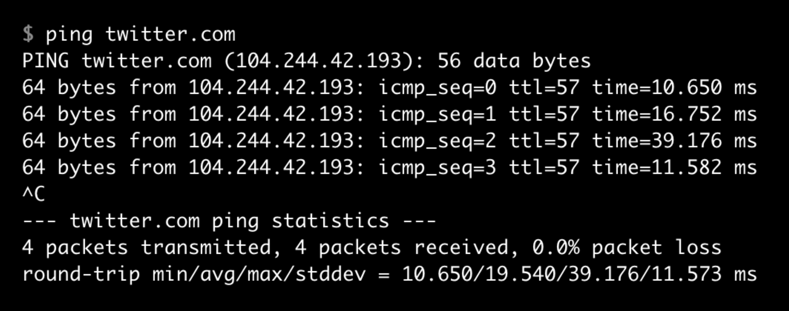

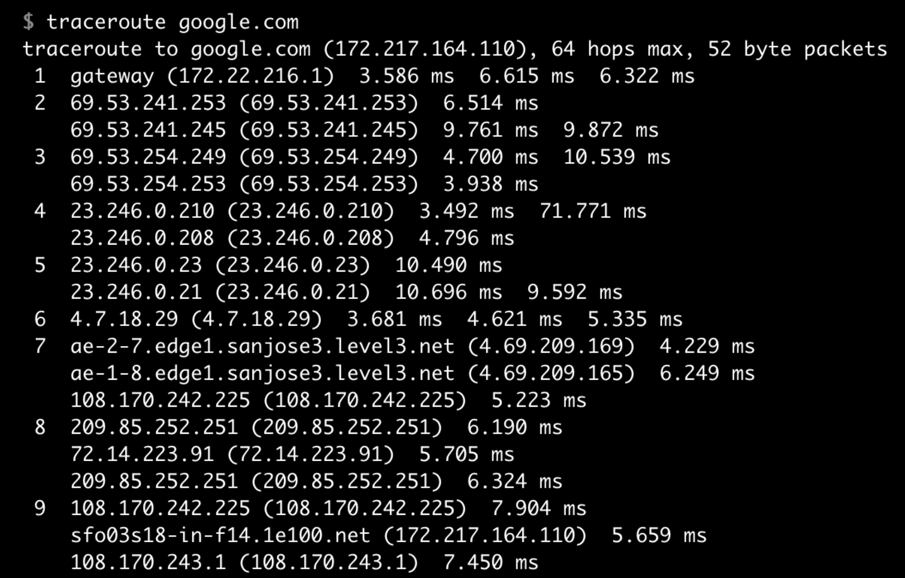

# Servers
It serves content and also respond request, it serves something back.
### VIM
Vim is a free and open-source, screen-based text editor program for Unix. It is an improved clone of Bill Joy's vi. Some more vim [command cheat sheets](https://linuxmoz.com/vi-commands-cheat-sheet/)

### Data centers and the cloud
Servers generally live in place called data center, a place full or racks of machine in a really cold environments. So a data center is just this colletions of computers, often shared between application and/or different companies.
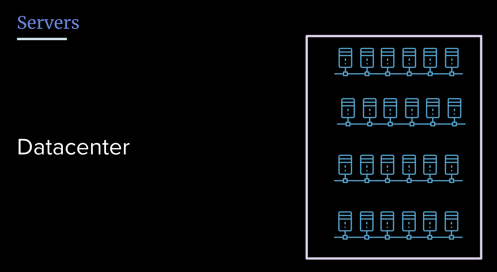

In cloud computing, elasticity is defined as "the degree to which a system is able to adapt to workload changes by provisioning and de-provisioning resources in an autonomic manner, such that at each point in time the available resources match the current demand as closely as possible.
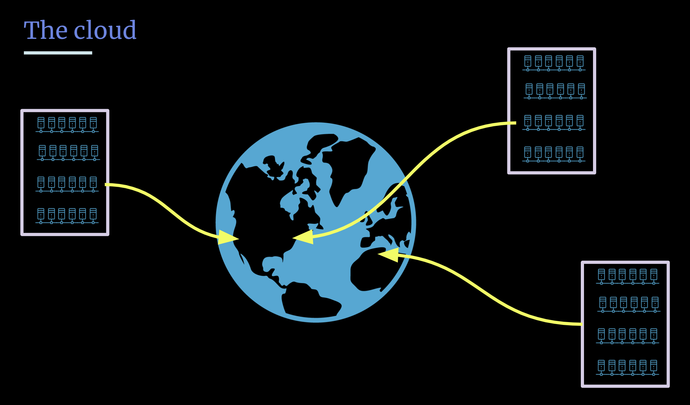

When we size the servers it called the VPS (Virtual Private Server), which in reality just a piece of the servers. example of VPS [www.digitalocean.com](https://m.do.co/c/3bea45abfdb1)

### Operating Systems
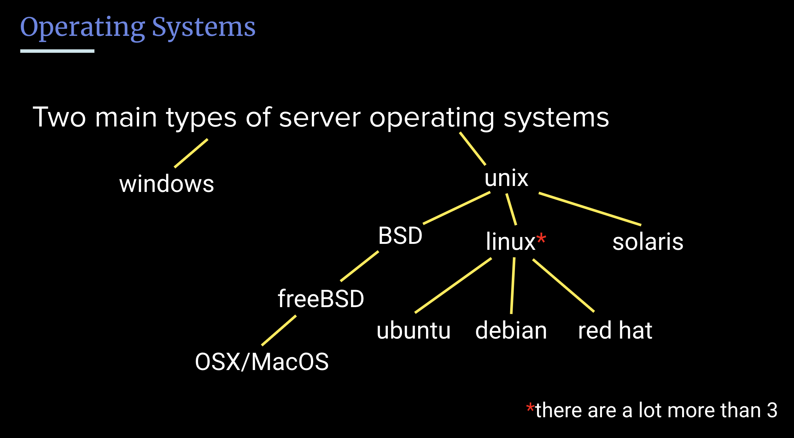

### SSH
The Secure Shell Protocol is a cryptographic network protocol for operating network services securely over an unsecured network. Its most notable applications are remote login and command-line execution. SSH applications are based on a client–server architecture, connecting an SSH client instance with an SSH server.
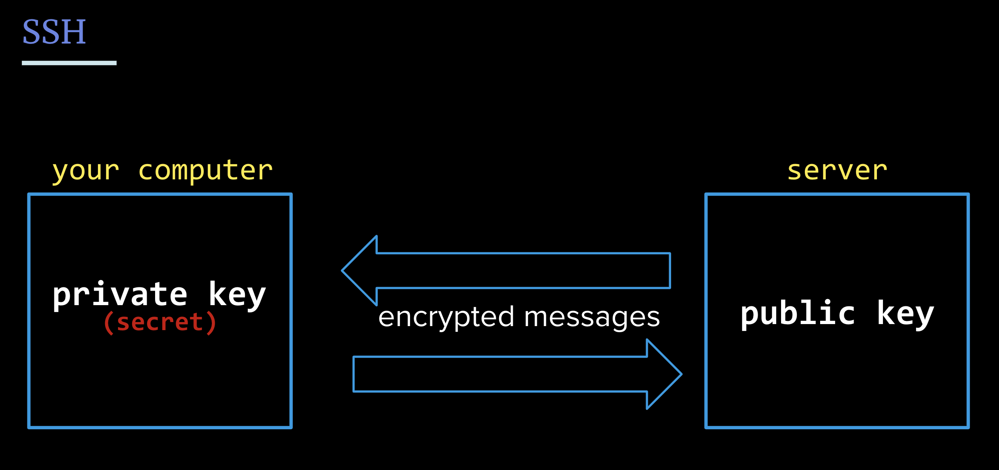

# Server Setup
Example where you can buy a [domain](http://www.namecheap.com)
### DNS Record
DNS records (aka zone files) are instructions that live in authoritative DNS servers and provide information about a domain including what IP address is associated with that domain and how to handle requests for that domain. These records consist of a series of text files written in what is known as DNS syntax.

### Domain Setup
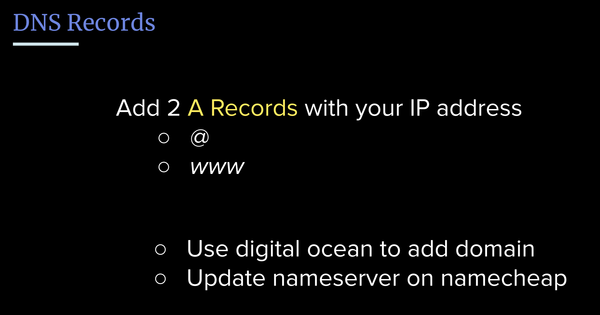

### Server Setup
Some thing that you might want to do to setup the server :
- Update software
- Create a new user
- Make that user a super user
- Enable login for new user
- Disable root login

Some command line example :
Update software
```
# apt update
```
Upgrade software
```
# apt upgrade
```
Add new user
```
# adduser $USERNAME
```
Add user to “sudo” group
```
# usermod -aG sudo $YOUR_USERNAME
```
Switch user
```
# su $YOUR_USERNAME
```
Check sudo access
```
$ sudo cat /var/log/auth.log
```
Change to home directory
```
$ cd ~
```
Create a new directory if it doesn’t exist
```
$ mkdir -p ~/.ssh
```
Create authorized_keys file and paste PUBLIC key
```
$ vi ~/.ssh/authorized_keys
```
Exit
```
$ exit
# exit
```
Login with new user
```
$ ssh $USERNAME@IP_ADDRESS
```
Change file permissions
```
$ chmod 644 ~/.ssh/authorized_keys
```
Disable root login
```
$ sudo vi /etc/ssh/sshd_config
```
Restart ssh daemon
```
$ sudo service sshd restart
```
### Nginx
Nginx, stylized as NGINX, nginx or NginX, is a web server that can also be used as a reverse proxy, load balancer, mail proxy and HTTP cache. The software was created by Igor Sysoev and publicly released in 2004. Nginx is free and open-source software, released under the terms of the 2-clause BSD license. it can do or act as :
- Reverse proxy
- Web server
- Proxy server

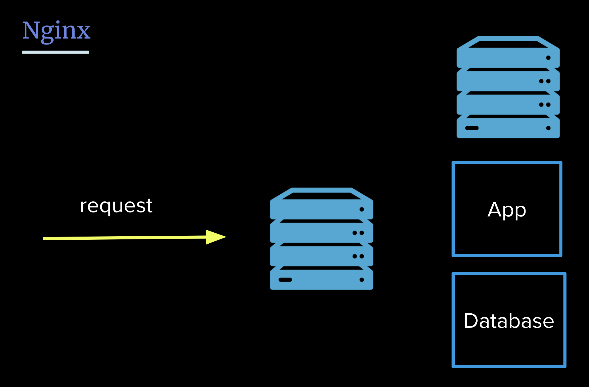
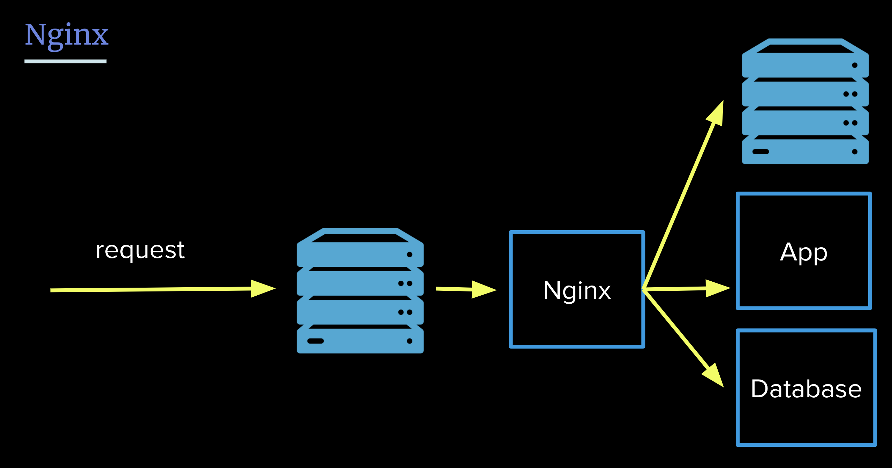

### Nginx Setup
Some of nginx command line :
Install nginx
```
$ sudo apt install nginx
```
Start nginx
```
$ sudo service nginx start
```
Show nginx configuration
```
$ sudo less /etc/nginx/sites-available/default
```
Create and edit index.html
```
$ sudo vi /var/www/html/index.html
```
### Node.js
Node.js is an open-source, cross-platform, back-end JavaScript runtime environment that runs on the V8 engine and executes JavaScript code outside a web browser.

Install NodeJS and npm
```
$ sudo apt install nodejs npm
```
Install git
```
$ sudo apt install git
```
### Application Architecture
An application architecture describes the patterns and techniques used to design and build an application. The architecture gives you a roadmap and best practices to follow when building an application, so that you end up with a well-structured app. Software design patterns can help you to build an application.
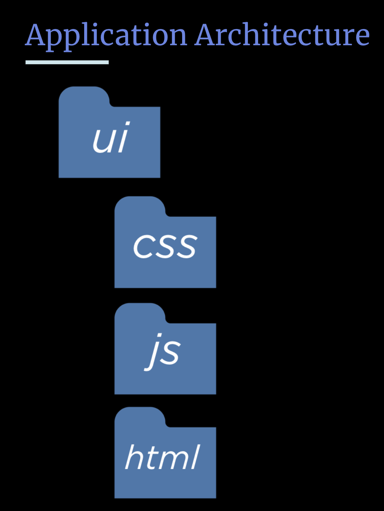

### Application Setup
Change ownership of the www directory to the current user
```
$ sudo chown -R $USER:$USER /var/www
```
Create application directory
```
$ mkdir /var/www/app
```
Move into app directory and initialize empty git repo
```
$ cd /var/www/app && git init
```
Create directories
```
$ mkdir -p ui/js ui/html ui/css
```
Create empty app file
```
$ touch app.js
```
Initialize project
```
$ npm init
```
install express
```
$ npm i express --save
```
edit app
```
$ vi app.js
```
Run application
```
$ node app.js
```
### Proxy Passing Traffic
Edit nginx config
```
$ sudo vi /etc/nginx/sites-available/default

location / {
  proxy_pass http://127.0.0.1:3000/;
}
```
### Process Manager
a process manager is a way to :
- Keeps your application running
- Handles errors and restarts
- Handle logging and clustering

Install PM2
```
$ sudo npm i -g pm2
```
Start PM2
```
$ pm2 start app.js
```
Setup auto restart
```
$ pm2 save
$ pm2 startup
```
### Version Control with Git
Record changes to a file system to preserve the history. Some example of version control :
- Git
- Subversion
- Mercurial

### Further Exploration
Install Fail2ban
> https://www.techrepublic.com/article/how-to-install-fail2ban-on-ubuntu-server-18-04/

ExpressJS performance tips
> http://expressjs.com/en/advanced/best-practice-performance.html

# Bash Basic
### Standard Streams
- standard output - `stdout`
- standard input - `stdin`
- standard error- `stderr`

Redirection
- `|` - read from stdout
- `>` - write stdout to file
- `>>` - append stdout to file
- `<` - read from stdin
- `2>` - read from stderr

### Find
`find` - search file names
useful options of find :
- name
- type
- empty
- executable
- writable
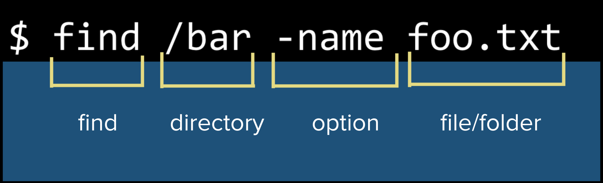
Find all log files in /var/log
```
$ find /var/log/nginx -type f -name “*.log”
```
Find all directories with the name ‘log’
```
$ find / -type d -name log
```
### Grep
`grep` - search file contents
search inside gzip file
```
$ zgrep FILE
```
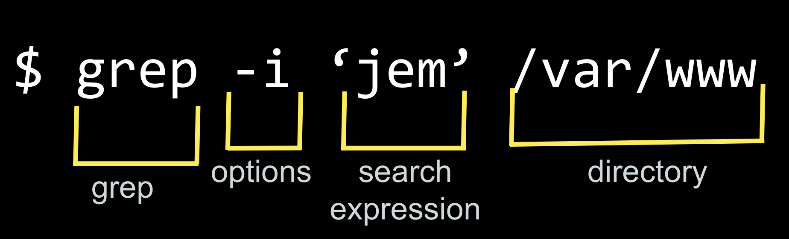
Find running node processes
```
$ ps aux | grep node
```
# Security
Security are very important to protect your server even if you think theres nothing worthwhile in it, from stealing your password to lock you out of your own server.

Read auth.log
```
$ sudo cat /var/log/auth.log
```

When it comes to security there are a few ways how to lock down our server :
- SSH
- Firewalls
- Updates
- Two factor authentication
- VPN

### Updates
Install unattended upgrades
```
$ sudo apt install unattended-upgrades
```
View conf file
```
$ cat /etc/apt/apt.conf.d/50unattended-upgrades
```

### Firewalls
A network security device that monitors incoming and outgoing network traffic and decides whether to allow or block specific traffic based on a defined set of security rules.

Install nmap
```
$ sudo apt install nmap
$ man nmap
```
Run nmap
```
$ nmap YOUR_SERVER_IP_ADDRESS
```
Run nmap with more service/version info
```
$ nmap -sV YOUR_SERVER_IP_ADDRESS
```
### Firewall - port
communication endpoint that maps to a specific process or network service. to see different version of port or the standart version of port :
```
$ less /etc/services
```
### Firewall - Uncomplicated Firewall (UFW)
Uncomplicated Firewall is a program for managing a netfilter firewall designed to be easy to use. It uses a command-line interface consisting of a small number of simple commands, and uses iptables for configuration.

Check firewall status
```
$ sudo ufw status
```
Enable ssh
```
$ sudo ufw allow ssh
```
Enable firewall
```
$ sudo ufw enable
```
To create UFW rule to block all HTTP connections
```
$ sudo ufw reject http
```
### Firewall - Permissions
[linux-chmod-permissions-cheat-sheet](https://isabelcastillo.com/linux-chmod-permissions-cheat-sheet)
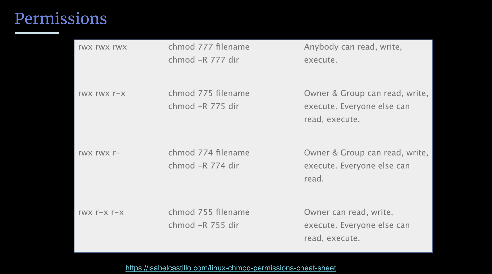

### Upgrade Node.js
Download setup script from nodesource
```
$ curl -sL https://deb.nodesource.com/setup_10.x -o nodesource_setup.sh
```
Run script
```
$ sudo bash nodesource_setup.sh
```
Install nodejs
```
$ sudo apt install nodejs
```
Update outdated packages
```
$ sudo npm update -g
```
# HTTP
Hypertext Transfer Protocol (HTTP) is an application-layer protocol for transmitting hypermedia documents, such as HTML. It was designed for communication between web browsers and web servers, but it can also be used for other purposes.
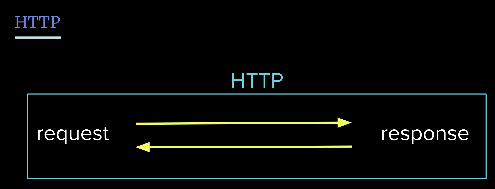

### HTTP Headers
HTTP headers let the client and the server pass additional information with an HTTP request or response. An HTTP header consists of its case-insensitive name followed by a colon ( : ), then by its value. Whitespace before the value is ignored.
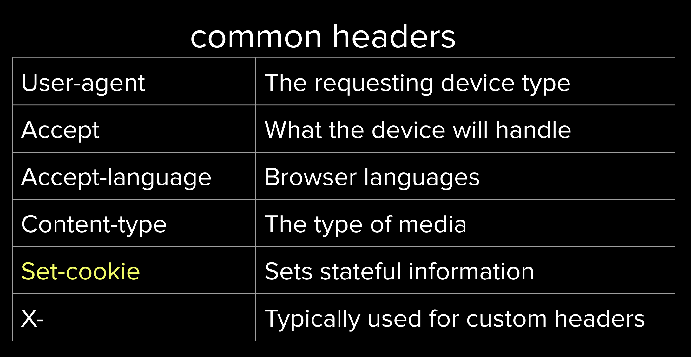

### HTTP Status Code
Indicates the status of an HTTP request
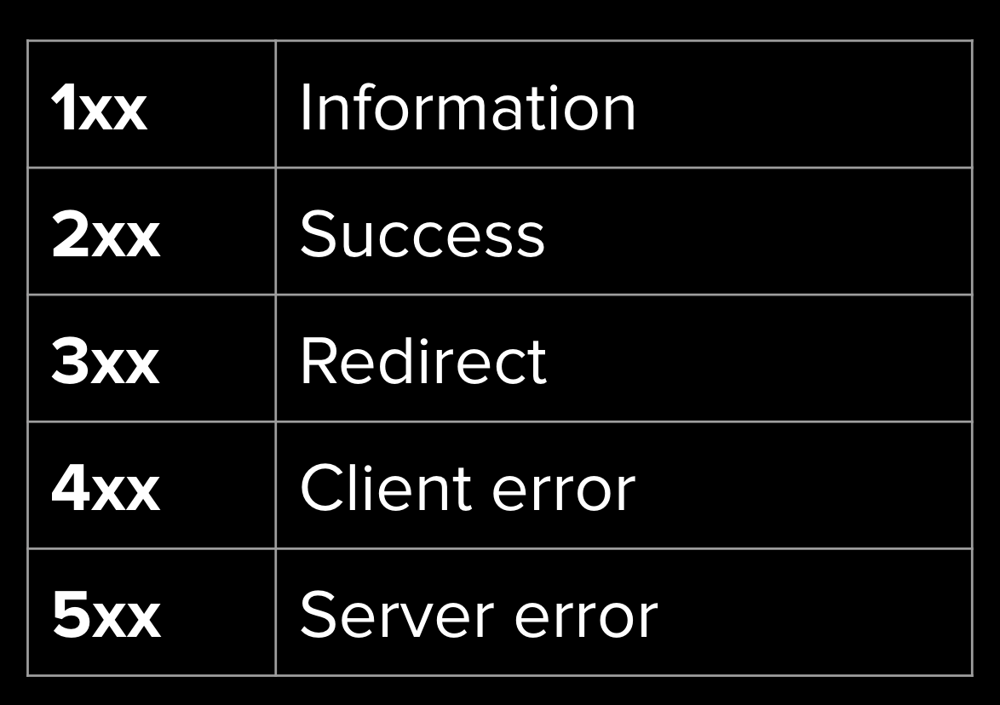
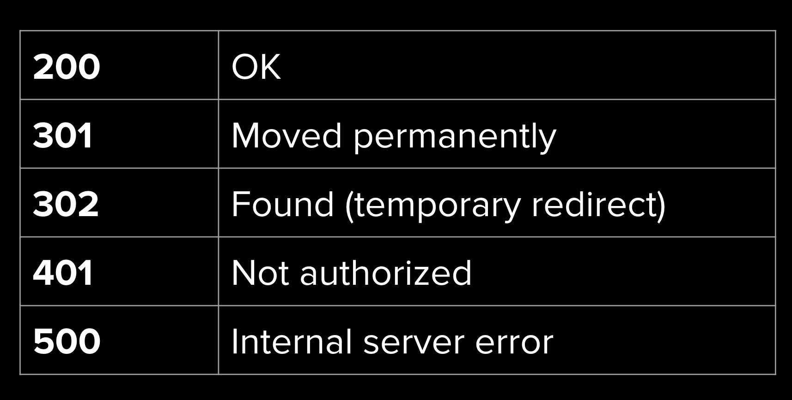

### HTTPS
Hypertext Transfer Protocol Secure (https) is a combination of the Hypertext Transfer Protocol (HTTP) with the Secure Socket Layer (SSL)/Transport Layer Security (TLS) protocol. TLS is an authentication and security protocol widely implemented in browsers and Web servers.

### HTTP/2
HTTP/2 is a major revision of the HTTP network protocol used by the World Wide Web. It was derived from the earlier experimental SPDY protocol, originally developed by Google. HTTP/2 was developed by the HTTP Working Group of the Internet Engineering Task Force.
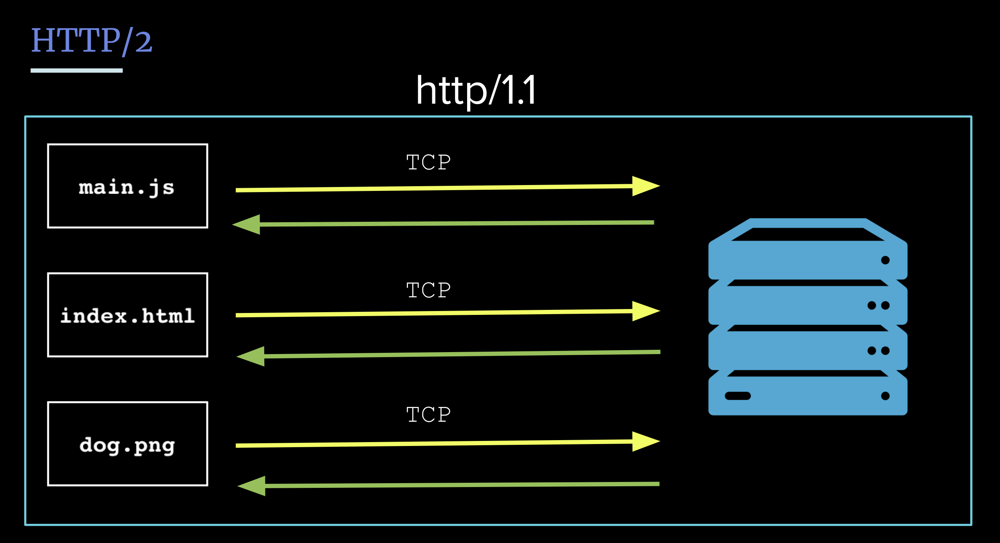
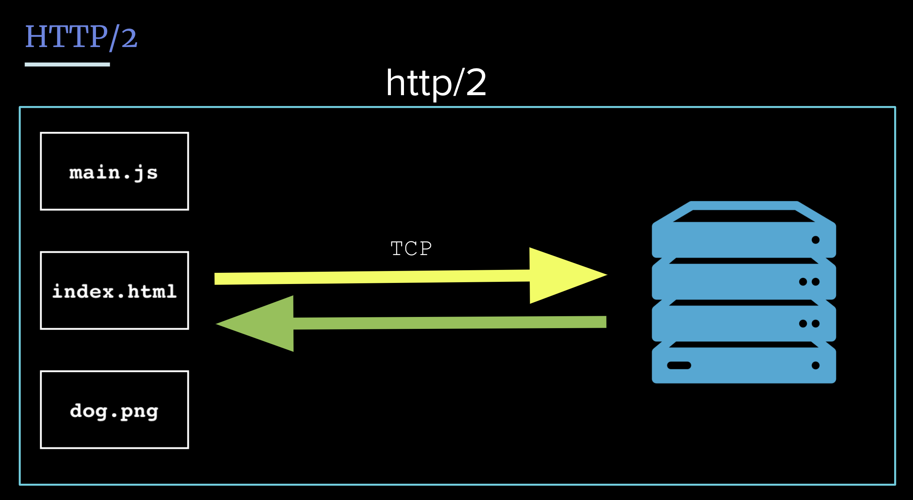
Edit nginx config
```
$ sudo vi /etc/nginx/sites-available/default
```
### HTTP/3
HTTP/3 is the third and upcoming major version of the Hypertext Transfer Protocol used to exchange information on the World Wide Web, alongside HTTP/1.1 and HTTP/2. HTTP/3 runs over QUIC (Quick UDP Internet Connections).

# Containers Basics
### Microservices
Architecture of loosely connected services
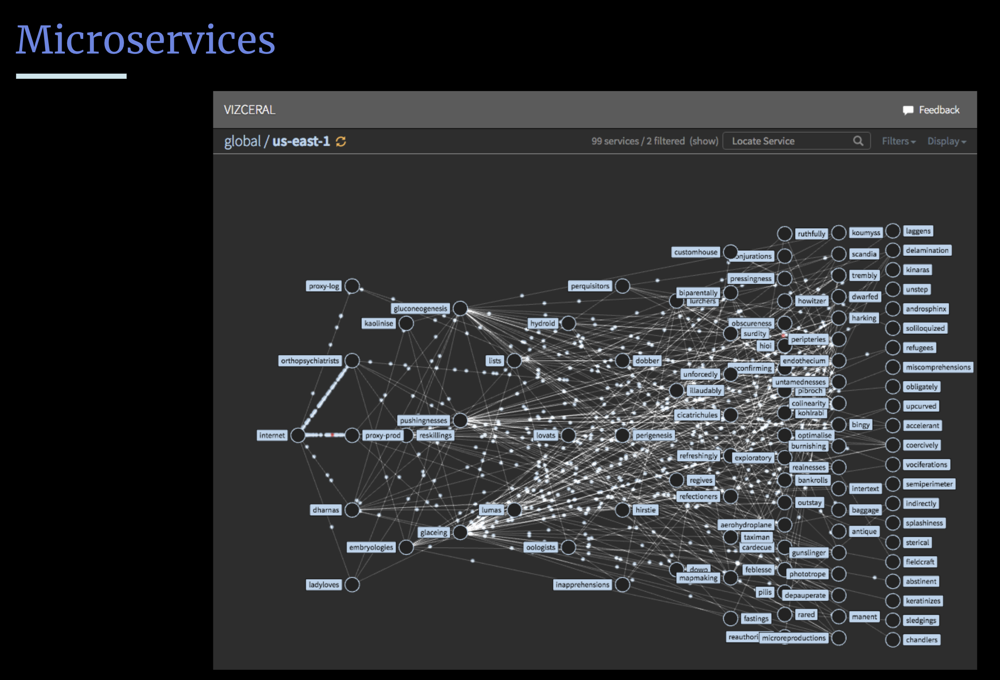

### Containers
Similiar to VM but instead of running out of operating system, they just run the set of libraries that it need, and only that, nothing else.
- Lightweight
- Portable
- Easier for development
- Easier to manage
- Faster startup
- Decouple application from infrastructure

### Docker
Docker is a set of platform as a service products that use OS-level virtualization to deliver software in packages called containers. The service has both free and premium tiers. The software that hosts the containers is called Docker Engine.

### Orchestration
Orchestration is the automated configuration, management, and coordination of computer systems, applications, and services. Orchestration helps IT to more easily manage complex tasks and workflows. IT teams must manage many servers and applications, but doing so manually isn't a scalable strategy.

Some example :
- Kubernetes - “K8s”
- Docker Swarm
- Amazon EKS
- Apache Mesos
- AKS

### Load Balancers
In computing, load balancing refers to the process of distributing a set of tasks over a set of resources, with the aim of making their overall processing more efficient. Load balancing can optimize the response time and avoid unevenly overloading some compute nodes while other compute nodes are left idle.
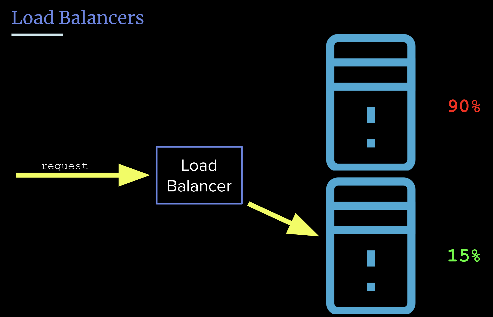

Load balancers work with a concept called scheduling algorithms, in which includes :
- Round Robin
- IP Hashing
- Random Choice
- Least Connections
- Least Load

Display running processes
```
$ top
```
Install htop
```
$ sudo apt install htop
```
Display running processes
```
$ htop
```
you can see more [here](https://docs.nginx.com/nginx/admin-guide/load-balancer/http-load-balancer/)

### Deployment
It means to bring the server into operation, to make it operational. In practice this means installing and configuring the requisite software to make it work as required. Some popular tools : 
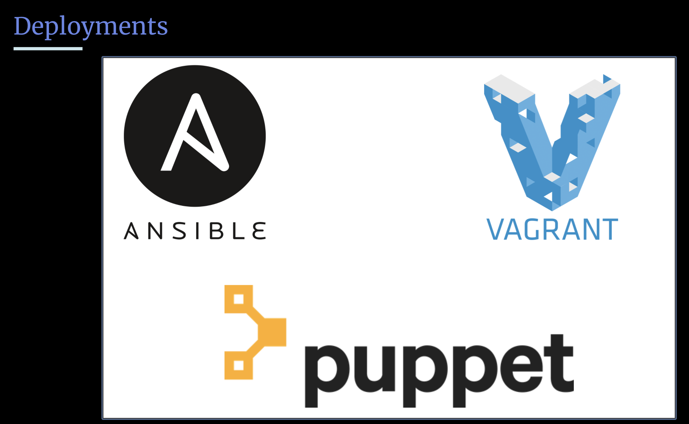

# Saving Data
### File
File are not optimized to be read in one part of the needed data. whether in the middle, in the beginning and the end. Thats why we save data in database instead of files.

### Database
relational database (ex: MySQL, PostgreSQL, SQLServer) :
- SQL
- Tables
- Related data
- Strict structure

non-relational database (ex: redis, elastic, mongodb, cassandra) : 
- NoSQL
- Data agnostic
- Loose structure

### redis
Install redis server
```
$ sudo apt install redis-server
```
Edit config to start with system
```
$ sudo vi /etc/redis/redis.conf
```
Restart redis server
```
$ sudo systemctl restart redis.service
```
### MySQL
Install mysql server
```
$ sudo apt install mysql-server
```
Run setup
```
$ mysql_secure_installation
```

### Websockets
WebSocket is a computer communications protocol, providing full-duplex communication channels over a single TCP connection. Persistent bidirectional connection between client and server.
